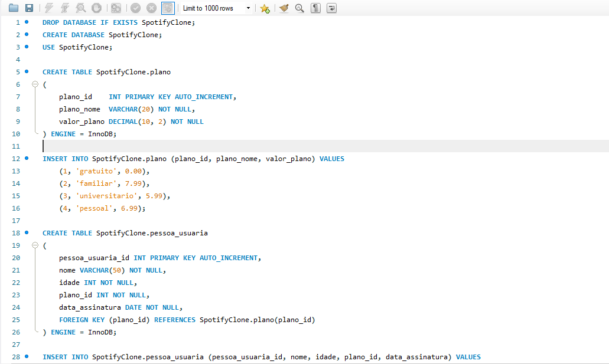
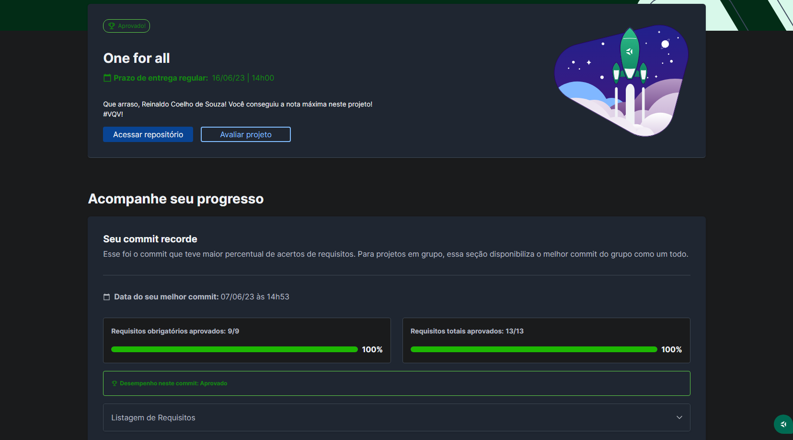

# 🐬 MySQL - One For All

## 📘 Sobre

Utilizei o MySQL Workbench para criar um banco de dados simplificado do Spotify. Normalizei uma tabela de dados e criei um banco de dados.

## ⚛️ Ferramentas

- Docker;
- MySQL.

## 🛠️ Como executar o projeto?

1. Suba os containers da aplicação com `docker-compose up -d`
2. Abra o terminal do container `docker exec -it one_for_all bash`

## 📝 Nota

## ©️ Copyright

- Os arquivos 'challenges' foram desenvolvidos por mim por mim, todo o resto é de autoria da Trybe.
